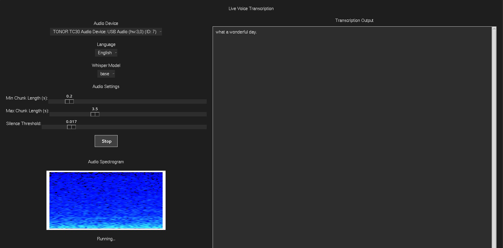

# Voice Transcription Application

A real-time voice transcription application with spectrogram visualization, built using Python and OpenAI's Whisper model. The application provides real-time transcription of speech with adjustable parameters and supports multiple languages.

## Features

- Real-time voice transcription using OpenAI's Whisper model
- Live spectrogram visualization
- Support for multiple languages
- Adjustable audio chunk sizes
- Silence threshold control
- GPU acceleration support
- Multiple Whisper model options (tiny, base, small, medium, large)
- Configurable minimum and maximum speech duration
- Input device selection
- Real-time transcription display with ordered results



## Requirements

- Python 3.11 or higher
- CUDA-capable GPU (optional, for better performance)
- Microphone input device

## Installation

1. Clone the repository:
```bash
git clone <repository-url>
cd VoiceChat
```

2. Create and activate a virtual environment:
```bash
python -m venv venv
source venv/bin/activate  # On Windows: venv\Scripts\activate
```

3. Install dependencies:
```bash
pip install -r requirements.txt
```

## Usage

1. Run the application:
```bash
python voice_recorder.py
```

2. Configure the application:
   - Select your input device from the dropdown
   - Choose your preferred language
   - Select the Whisper model size (tiny, base, small, medium, large)
   - Adjust minimum and maximum chunk lengths using the sliders
   - Set the silence threshold to control speech detection sensitivity

3. Start recording:
   - Click the "Start" button or press the space bar
   - Speak into your microphone
   - View real-time transcription in the text box
   - Click "Stop" or press space bar again to stop recording

## Controls

- **Input Device**: Select your microphone
- **Language**: Choose the language for transcription
- **Whisper Model**: Select the model size (affects accuracy and performance)
- **Min Chunk Length**: Minimum duration of speech segments (0.1-1.0 seconds)
- **Max Chunk Length**: Maximum duration of speech segments (1.0-10.0 seconds)
- **Silence Threshold**: Control speech detection sensitivity (0.001-0.1)
- **Start/Stop**: Toggle recording

## Performance Tuning

1. **Whisper Model Selection**:
   - Tiny: Fastest, lowest accuracy
   - Base: Good balance of speed and accuracy
   - Small: Better accuracy, moderate speed
   - Medium: High accuracy, slower
   - Large: Best accuracy, slowest

2. **Chunk Length Settings**:
   - Smaller chunks: More responsive but may miss context
   - Larger chunks: Better context but higher latency
   - Adjust based on your speaking style and system performance

3. **Silence Threshold**:
   - Lower values (0.001-0.01): More sensitive to quiet sounds
   - Higher values (0.01-0.1): Require louder speech
   - Adjust based on your microphone and environment noise

4. **GPU Usage**:
   - Enable CUDA for better performance
   - Monitor GPU memory usage with larger models
   - Adjust chunk sizes if experiencing memory issues

## Supported Languages

The application supports transcription in multiple languages including:
- English
- Spanish
- French
- German
- Italian
- Portuguese
- Dutch
- Russian
- Japanese
- Korean
- Chinese
- Arabic
- And many more...

## Troubleshooting

1. **No Audio Input**:
   - Check if your microphone is properly connected
   - Verify the selected input device in the dropdown
   - Adjust the silence threshold if needed

2. **Poor Transcription Quality**:
   - Try using a larger Whisper model
   - Adjust the chunk length settings
   - Ensure clear audio input
   - Fine-tune the silence threshold

3. **Performance Issues**:
   - Switch to a smaller Whisper model
   - Increase chunk lengths
   - Check GPU memory usage
   - Adjust silence threshold to reduce processing

4. **Memory Issues**:
   - Use a smaller Whisper model
   - Increase chunk sizes
   - Enable CUDA memory optimization
   - Clear GPU cache regularly

## License

This project is licensed under the MIT License - see the LICENSE file for details.

## Acknowledgments

- OpenAI for the Whisper model
- SoundDevice for audio input handling
- VisPy for spectrogram visualization
- PyTorch for deep learning support 